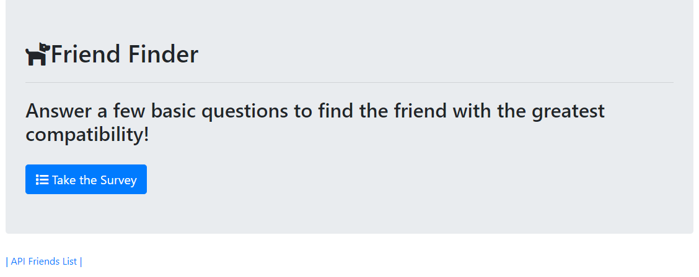
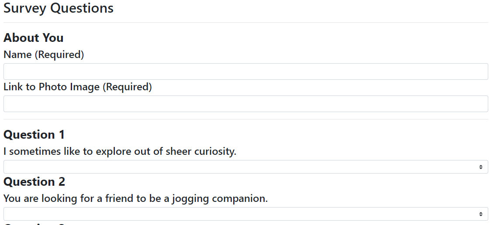
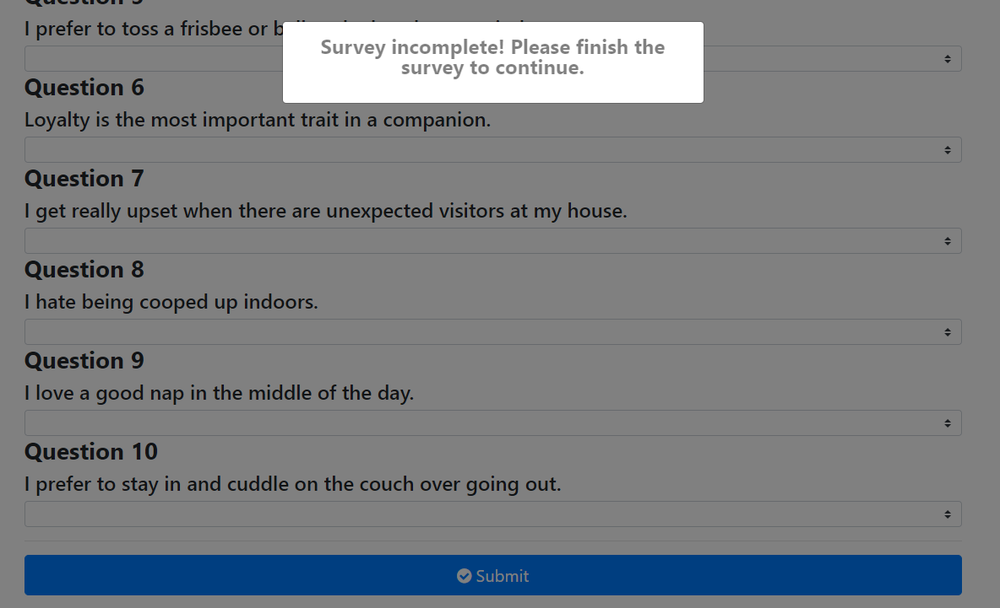
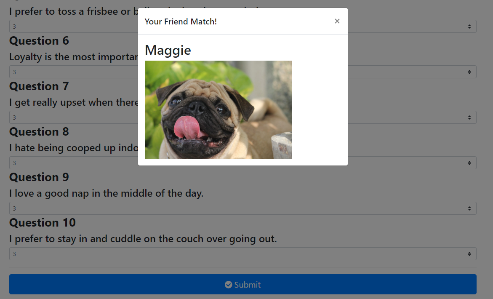

# FriendFinderPet App

FriendFinderPet allows a user to take a 10 question 

## Link to Live App

https://friendfinderpet.herokuapp.com/

## Technologies Used

* HTML/CSS
* Bootstrap
* JavaScript/JQuery
* Node.js
* Express.js

### Home Page

The FriendFinderPet home page with links to the survey page and the Friend List API.

### Suvery Page

The FriendFinderPet survey page.

### Validation

If the user tries to submit an incomplete survey the form will not submit and a modal will pop up urging the user to complete the survey.

### Match

